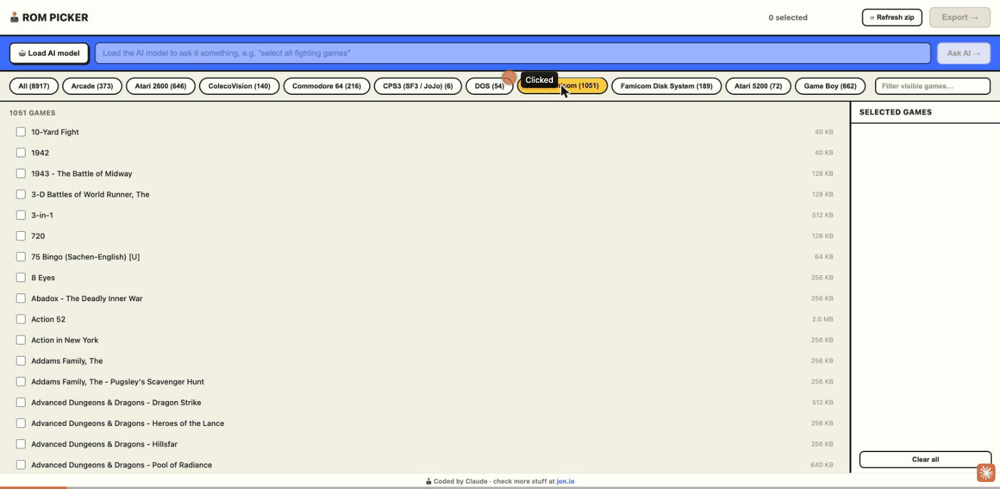
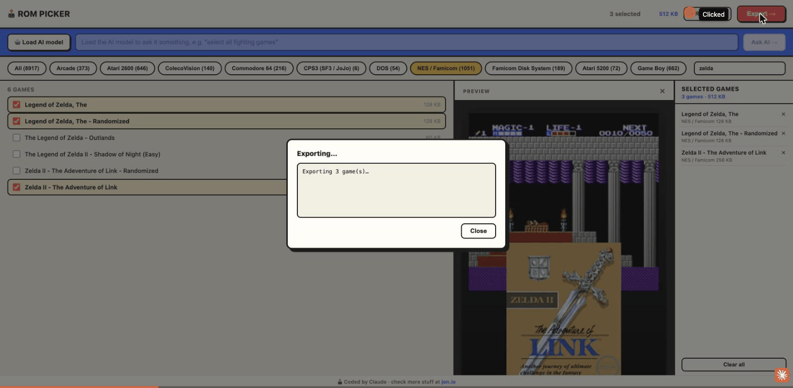
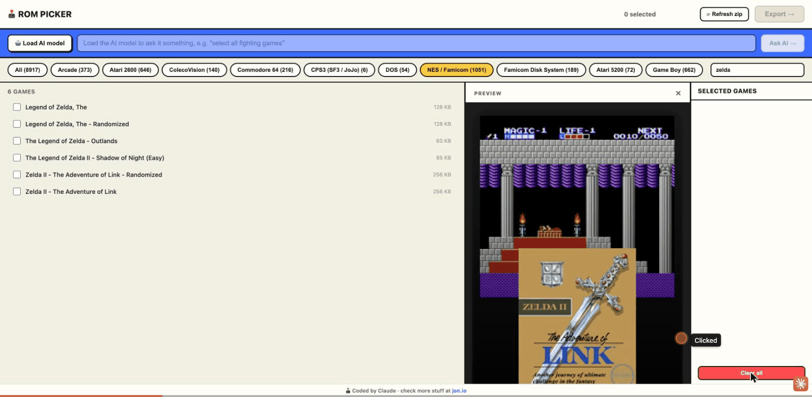
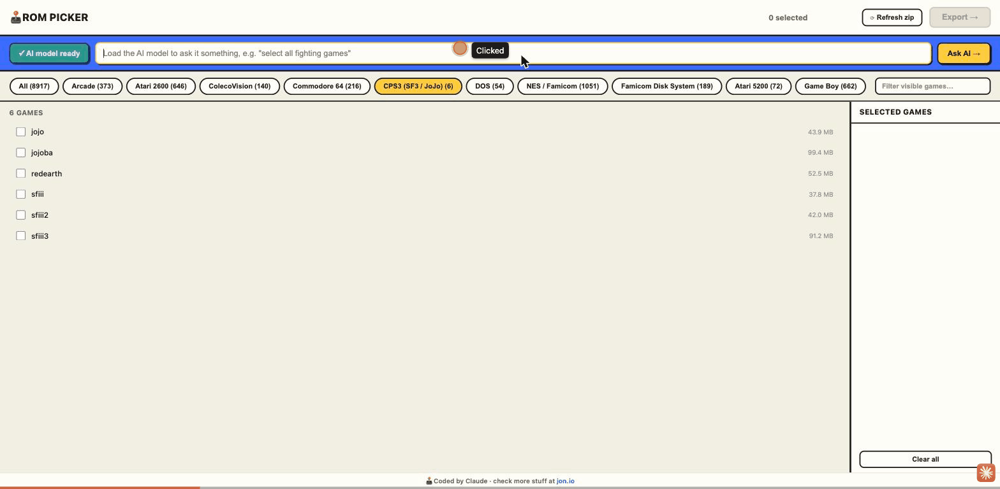

# RomSelector

A single-file Python web app for browsing games inside a zip archive and exporting selected ones to a local folder. No dependencies — just Python 3.



## What it does

- Serves a web UI you can open in any browser
- Lists all games from a zip, grouped by platform with a search bar
- Click to select any combination of games across platforms
- Press **Export** to extract them into an `output/` folder
- Works great over a local network — run it on a server, browse from any device

## Requirements

- Python 3.6 or newer
- That's it. No pip installs, no virtual environments.

## Setup

1. Clone or download this repo:
   ```bash
   git clone https://github.com/yourname/RomSelector.git
   cd RomSelector
   ```

2. Place your zip file in the same folder as `rom_picker.py`, or note its path for step 3.

## Usage

**Basic** — zip is in the same folder as the script:
```bash
python3 rom_picker.py
```

**Custom zip path:**
```bash
python3 rom_picker.py "/path/to/Roms and games.zip"
```

**Custom zip path and port:**
```bash
python3 rom_picker.py "/path/to/Roms and games.zip" 9000
```

Then open your browser at:
```
http://localhost:8000
```

Or from another machine on the same network:
```
http://<server-ip>:8000
```

## How to use the UI

1. **Browse** — use the platform tabs to filter by system (NES, GBA, SNES, Neo Geo, ScummVM, etc.)
2. **Filter** — type in the **Filter visible games…** box next to the tabs to filter by name
3. **Select** — click any game row to select it; selected games appear in the sidebar on the right with a running total size
4. **Export** — click the **Export →** button; a log shows each file being written to `./output/<platform>/`
5. **AI assistant** — load a local LLM and ask it to pick games for you in plain English (see below)



Exported files are organized by platform:
```
output/
├── GBA/
│   ├── Castlevania - Aria of Sorrow.zip
│   └── Metroid Fusion.zip
├── SFC/
│   ├── Chrono Trigger.7z
│   └── Super Metroid.7z
├── SCUMMVM/
│   └── Day of the Tentacle/
│       ├── TENTACLE.000
│       └── TENTACLE.001
└── ...
```

ScummVM games (which are stored as loose files in folders inside the zip) are extracted as complete folders automatically.

## Zip format assumptions

The script expects games to be organized inside the zip like this:
```
Roms/<PLATFORM>/<game file>
```

For example:
```
Roms/GBA/Castlevania - Aria of Sorrow.zip
Roms/SFC/Chrono Trigger.7z
Roms/SCUMMVM/Day of the Tentacle/TENTACLE.000
```

This matches the standard layout used by many curated ROM sets. If your zip uses a different structure, edit the `load_games()` function in `rom_picker.py` — the relevant line is where `parts[0]` is checked for `"Roms"`.

## Running on a home server (e.g. Raspberry Pi, NAS)

```bash
# Run in the background, accessible from your whole network
nohup python3 rom_picker.py "/mnt/nas/Roms and games.zip" 8000 &
```

Then bookmark `http://<server-ip>:8000` on your phone or any device.

To stop it:
```bash
kill $(lsof -ti:8000)
```

## AI assistant (local, no API key)

RomSelector includes an optional AI search bar right below the header, powered by [WebLLM](https://webllm.mlc.ai/). It runs **entirely in your browser** using WebGPU — no server, no API key, no data leaves your machine.

The AI search bar is disabled until you load the model — it only works once the AI is enabled. Plain text filtering lives separately, in the small **Filter visible games…** box next to the platform tabs.

**Setup:**
1. Open the app in a browser that supports WebGPU (Chrome 113+, Edge 113+)
2. Click **Load AI model** — this downloads Phi-3.5 mini (~2.4 GB) the first time and caches it locally, and unlocks the search bar
3. Type a request in the search bar and press Enter or **Ask AI →**



> **Note:** WebGPU requires a "secure context" — `https://`, or `http://` on `localhost`/`127.0.0.1`. If you access RomSelector from another device over the LAN (`http://192.168.x.x:8000`, per the [home server setup](#running-on-a-home-server-eg-raspberry-pi-nas) above), Chrome will report WebGPU as unsupported even though it works fine locally. To use the AI bar over the LAN in Chrome, add the exact origin (e.g. `http://192.168.1.50:8000`) to `chrome://flags/#unsafely-treat-insecure-origin-as-secure` and relaunch the browser. The rest of the app (browsing, filtering, export) works normally over plain HTTP either way — only the AI bar needs this. Safari's WebGPU support is experimental.

**Example queries:**
- `select all fighting games`
- `best games from Nintendo`
- `give me some RPGs`
- `show me co-op multiplayer games`
- `Sega classics`

**Scope and speed:** the AI scans whichever platform tab is currently active — click a tab (e.g. **SNES**) before asking to keep it fast. Leaving **All** selected scans the entire library in batches, which can take several minutes on a large collection. You can still manually add or remove games afterwards.



## Contributing

PRs welcome. Some ideas for improvements:

- Show game artwork from `Imgs/` folders inside the zip (they're already there!)
- Add a "select all visible" checkbox
- Support multiple zip files
- Add a progress bar for large exports
- Dark/light mode toggle
- Remember selections across sessions (localStorage)

## License

MIT
